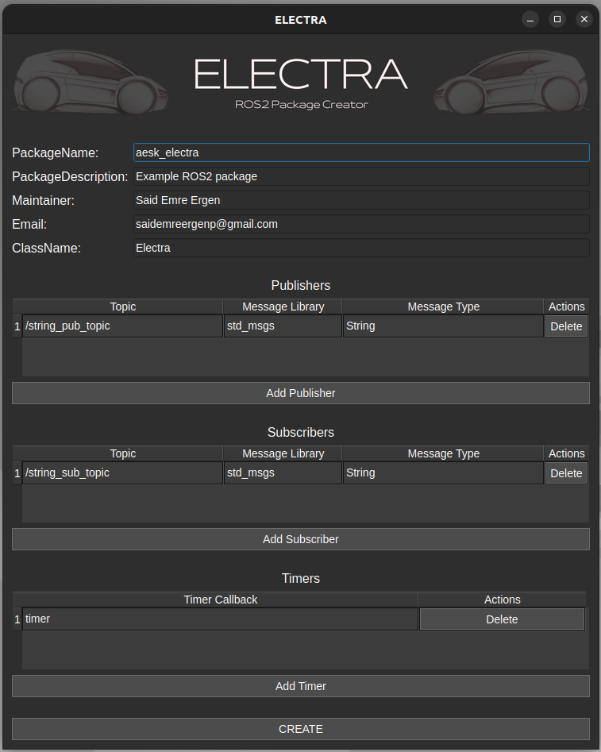

# Electra


**Electra** is a **ROS2 package creator** tool. It simplifies the creation of ROS2 packages with a user-friendly interface and automated configuration support.

## ✨ Features

- **Easy to Use**: Intuitive GUI for seamless package creation.
- **Customizable Packages**: Add publishers, subscribers, and timer callbacks.
- **Automated File Generation**: Automatically creates `CMakeLists.txt`, `package.xml`, and `hpp/cpp` files.
- **C++ and ROS2 Humble Support**: Currently supports only C++ and ROS2 Humble on Linux.

## ⚡ Installation


```bash
git clone https://github.com/user/Electra.git
cd Electra
```

## ⚙ Usage

1. **Start Electra Interface**:
    ```bash
    ./electra
    ```
2. **Enter Package Name and Description**: Provide a name and description for your ROS2 package.
3. **Define Components**: Add publishers, subscribers, and timers.
4. **Generate Your Package**: Click the "CREATE" button to generate the package.

## 🔄 Example Usage




## ✨ License

This project is licensed under the **Apache License 2.0**. See the `LICENSE` file for more details.

